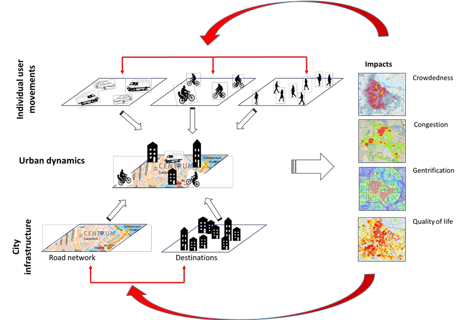

# Introduction

Cities like other complex adaptive systems commonly develop in an open-ended and often unexpected way with neighborhoods and urban populations in constant development. These urban dynamics exhibit many wicked problems in which the issue at hand as well the potential solutions are strongly dependent on the perspectives of the multitude of stakeholders involved.

Conflicting use-patterns among city users impact a multitude of urban quality indicators and result in specific spatial-temporal patterns and conflicts (Fig. 1). Currently, our understanding of these complex processes remains limited and even more so our capacity to anticipate these complex developments.

## Objective

Against this backgound the objective of the City Simulation Lab is:

1) To develop a City Simulator toolbox including various agent-based models of urban systems
2) To increase our current understanding of complex urban processes leading to specific spatial-temporal patterns through simulation of urban systems through the implementation of the agent-based simulation toolbox.
3) To improve the capacity to anticipate complex urban dynamics through interactive participatory workshops developing and implementing a Participatory Urban Modelling (PUM) framework.

## Methods

### Case: Tourism expansion in Amsterdam

Amsterdam has seen a steep 40% increase in tourists in just five years, with currently 17 million people visiting the city on annual basis. This strong increase impacts the liveability of the city and causes conflicts among different users of the city.

### Participatory Urban Modelling (PUM)

In order to include the different perspectives of local stakeholders, we developed a Participatory Urban Modelling (PUM) framework. Within this cyclic process researchers and stakeholders actively collaborate in the development of the City Simulator toolbox through a combination of  (simulation)  games  (Fig.2).  Through  interactive  gaming workshops, stakeholders collectively define potential policy changes and explore the impacts on quality indicators and spatial conflicts.

