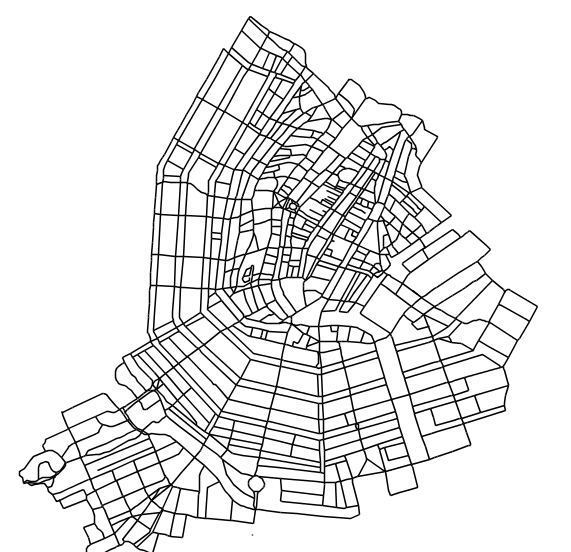
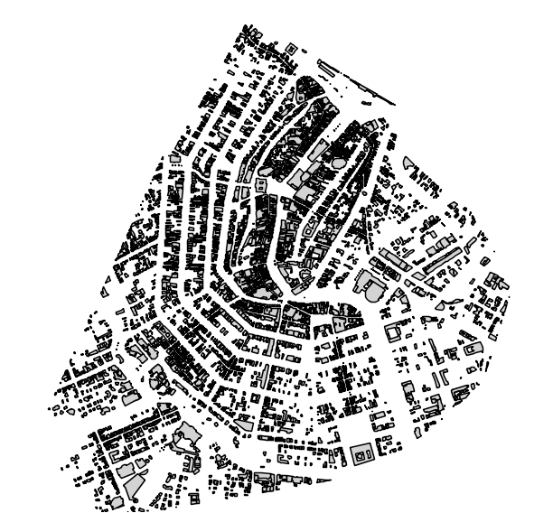

# Species

The model has 4 species [inhabitants, buildings, roads, public transport system]

## road 

This species is imported from a shapefile. The attributes of this shapefile are imported and mapped into various model variables - as attributes of the road species. 

## buildings

This species is imported froma  shapefile. The attributes of this shapefile are imported and mapped into various model variables - as attributes of the building species. The main classification of buildings is based on its usage. Curerntly the model only distinguishes between [office, home].

